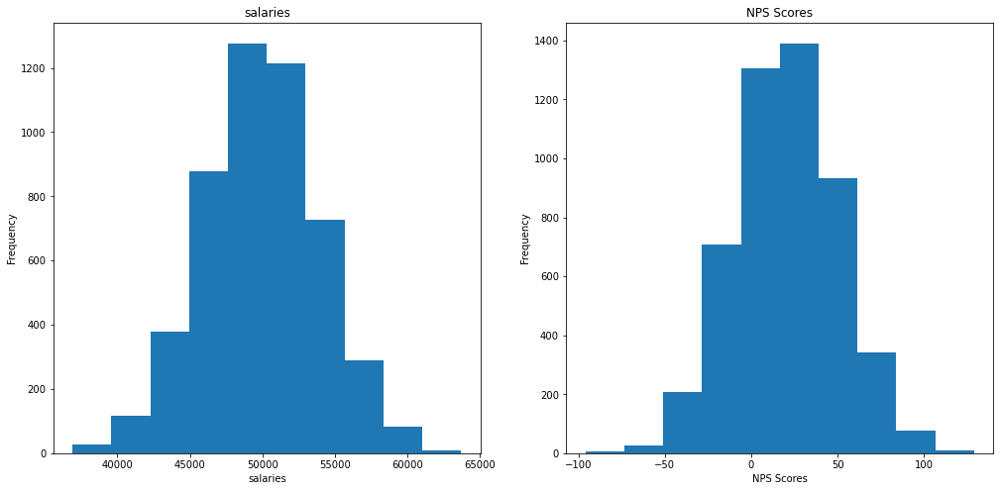
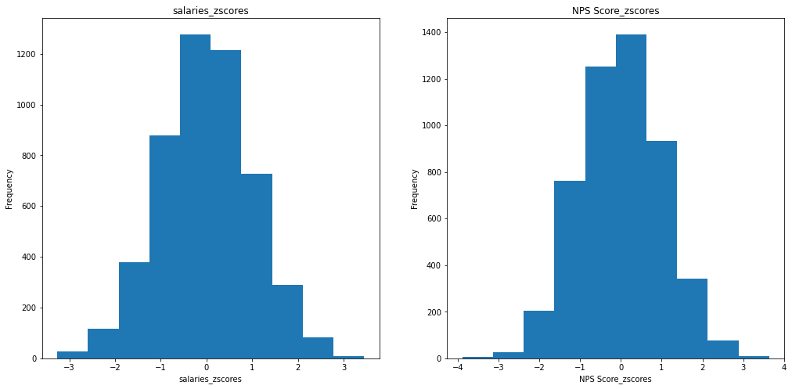
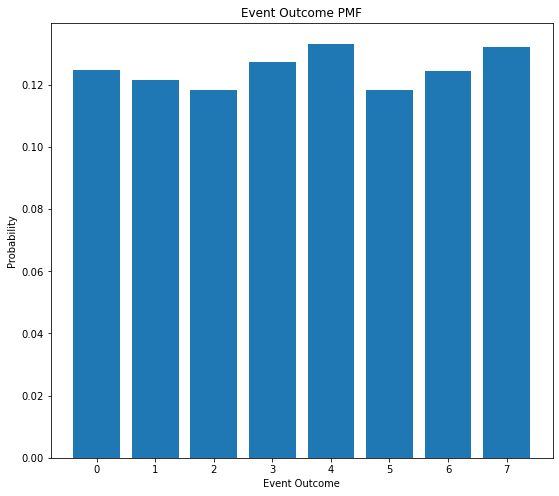
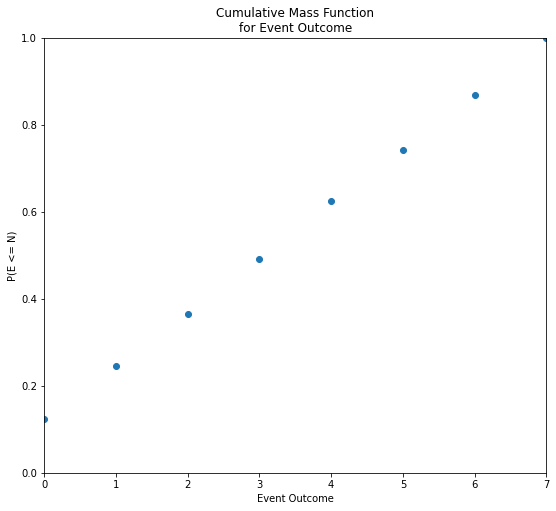
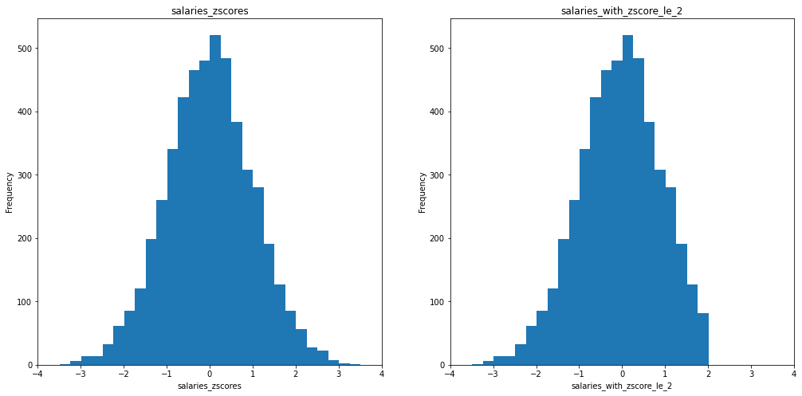
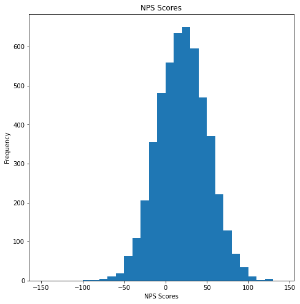
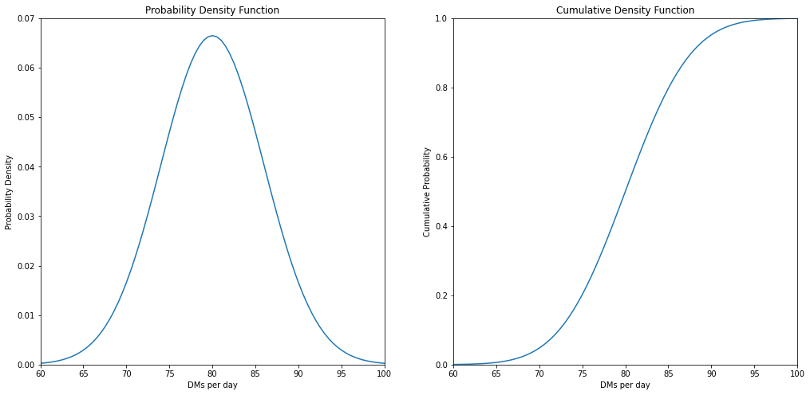

# Objectives
YW
* scrape a website for relevant information, store that information to a dataframe and save that dataframe as a csv file
* load in a dataframe and do the following
    * calculate the zscores of a given column
    * calculate the zscores of a point from a given column in the dataframe
    * calculate and plot the pmf and cdf of another column

# Part 1 - Webscraping
* use the following url scrape the first page of results
* for each item get the name of the item
* store the names to a dataframe and save that dataframe to csv then display
    * store the dataframe in the `data` folder in the repo
    * name the file `part1.csv` and make sure that when you write it you set `index=False`
* the head of the dataframe

* it should match the following


```python
import pandas as pd
from IPython.display import display
from bs4 import BeautifulSoup
import requests

url = "https://www.petsmart.com/dog/treats/dental-treats/#page_name=flyout&category=dog&cta=dentaltreat"

# scrape the names of the items on the webpage above
resp = requests.get(url)
soup = BeautifulSoup(resp.content, "html5lib")
item_names = [broth.find("a")['title'] for broth in soup.find_all("li", class_="grid-tile col-md-4 col-sm-12")]
print("-----------------------------------------------------------")
print()
print("The list of item names 'item_names' is displayed as follows:")
display(item_names)
print()
print("THE OUTPUT ABOVE DEMONSTRATES 'scrape the names of the items on the webpage'.")
print()

# load the data into a dataframe file
df = pd.DataFrame(item_names, columns=['item name']) 
print("-----------------------------------------------------------")
print()
print("The dataframe 'df' is displayed as follows:")
display(df)
print()
print("THE OUTPUT ABOVE DEMONSTRATES 'load the data into a dataframe file'.")
print()

# save the data as a csv file
df.to_csv (r'.\data\item_names.csv', index = False, header=True)
df_in = pd.read_csv(r'.\data\item_names.csv')
print("-----------------------------------------------------------")
print()
print("The dataframe 'df_in' is displayed as follows:")
display(df_in)
print()
print("THE OUTPUT ABOVE DEMONSTRATES 'save the data as a csv file'.")
print()

# display df.head()
print("-----------------------------------------------------------")
print()
print("'df.head()' is displayed as follows:")
display(df.head())
print()
print("THE OUTPUT ABOVE DEMONSTRATES 'display df.head()'.")
print()

```

    -----------------------------------------------------------
    
    The list of item names 'item_names' is displayed as follows:
    


    ['Greenies Regular Dental Dog Treats',
     'Greenies Teenie Dental Dog Treats',
     'Greenies Large Dental Dog Treats',
     'Authority® Dental & DHA Stick Puppy Treats Parsley Mint - Gluten Free, Grain Free',
     'Greenies Petite Dental Dog Treats',
     'WHIMZEES Brushzees Dental Dog Treat - Natural, Grain Free, 1 Count',
     'Pedigree Dentastix Triple Action Dental Dog Treats - Variety Pack',
     'Pedigree Dentastix Large Dog Treats',
     'Pedigree Dentastix Large Dog Sticks',
     'Authority® Dental & DHA Rings Puppy Treats Parsley Mint - Gluten Free, Grain Free',
     'WHIMZEES Veggie Sausage Dog Dental Treat - Natural, 1 Count',
     'Pedigree Dentastix Small/Medium Dog Sticks',
     'Greenies Teenie Dog Dental Treats - Blueberry',
     'Virbac® C.E.T.® VeggieDent® Tartar Control Dog Chews',
     'Pedigree Dentastix Triple Action Small Dog Treats - Fresh',
     'WHIMZEES Variety Value Box Dental Dog Treat - Natural, Grain Free',
     'Authority Dental & Multivitamin Large Dog Treats Parsley Mint - Gluten Free, Grain Free',
     'Yummy Combs® Ingenious Flossing Dog Dental Treat - 1 Count',
     'Pedigree Dentastix Large Dog Sticks',
     'Pedigree Dentastix Mini Dog Sticks',
     'Authority® Dental & Multivitamin Medium Dog Treats Parsley Mint - Gluten Free, Grain Free',
     'Ark Naturals® Brushless Toothpaste 4-in-1 Small Dog Dental Chews - 8-20 lbs.',
     'Ark Naturals® Brushless Toothpaste 4-in-1 Large Dog Dental Chews - 40+ lbs.',
     'Milk-Bone Brushing Chews Large Dental Dog Treats',
     'Milk-Bone Brushing Chew Mini Dental Dog Treats',
     'Authority Dental & Multivitamin Small Dog Treats Parsley Mint - Gluten Free, Grain Free',
     'WHIMZEES Stix Dental Dog Treat - Natural, 1 Count',
     'Greenies Teenie Dental Dog Treats - Fresh',
     'Greenies Regular Dog Dental Treats - Blueberry',
     'WHIMZEES Hedgehog Dental Dog Treat - Natural, 1 Count',
     'Authority Dental & Multivitamin Parsley Mint Dog Treat Bites - Gluten Free, Grain Free',
     'WHIMZEES Alligator Dental Dog Treat - Natural, 1 Count',
     'Greenies Petite Dental Dog Treats - Blueberry',
     'Pedigree Dentastix Dual Flavor Mini Dental Dog Treats',
     'Yummy Combs® Ingenious Flossing Dog Dental Treats - Chicken',
     'WHIMZEES Brushzees Medium Dental Dog Treat - Natural, Grain Free']


    
    THE OUTPUT ABOVE DEMONSTRATES 'scrape the names of the items on the webpage'.
    
    -----------------------------------------------------------
    
    The dataframe 'df' is displayed as follows:
    


<div>
<style scoped>
    .dataframe tbody tr th:only-of-type {
        vertical-align: middle;
    }

    .dataframe tbody tr th {
        vertical-align: top;
    }

    .dataframe thead th {
        text-align: right;
    }
</style>
<table border="1" class="dataframe">
  <thead>
    <tr style="text-align: right;">
      <th></th>
      <th>item name</th>
    </tr>
  </thead>
  <tbody>
    <tr>
      <th>0</th>
      <td>Greenies Regular Dental Dog Treats</td>
    </tr>
    <tr>
      <th>1</th>
      <td>Greenies Teenie Dental Dog Treats</td>
    </tr>
    <tr>
      <th>2</th>
      <td>Greenies Large Dental Dog Treats</td>
    </tr>
    <tr>
      <th>3</th>
      <td>Authority® Dental &amp; DHA Stick Puppy Treats Par...</td>
    </tr>
    <tr>
      <th>4</th>
      <td>Greenies Petite Dental Dog Treats</td>
    </tr>
    <tr>
      <th>5</th>
      <td>WHIMZEES Brushzees Dental Dog Treat - Natural,...</td>
    </tr>
    <tr>
      <th>6</th>
      <td>Pedigree Dentastix Triple Action Dental Dog Tr...</td>
    </tr>
    <tr>
      <th>7</th>
      <td>Pedigree Dentastix Large Dog Treats</td>
    </tr>
    <tr>
      <th>8</th>
      <td>Pedigree Dentastix Large Dog Sticks</td>
    </tr>
    <tr>
      <th>9</th>
      <td>Authority® Dental &amp; DHA Rings Puppy Treats Par...</td>
    </tr>
    <tr>
      <th>10</th>
      <td>WHIMZEES Veggie Sausage Dog Dental Treat - Nat...</td>
    </tr>
    <tr>
      <th>11</th>
      <td>Pedigree Dentastix Small/Medium Dog Sticks</td>
    </tr>
    <tr>
      <th>12</th>
      <td>Greenies Teenie Dog Dental Treats - Blueberry</td>
    </tr>
    <tr>
      <th>13</th>
      <td>Virbac® C.E.T.® VeggieDent® Tartar Control Dog...</td>
    </tr>
    <tr>
      <th>14</th>
      <td>Pedigree Dentastix Triple Action Small Dog Tre...</td>
    </tr>
    <tr>
      <th>15</th>
      <td>WHIMZEES Variety Value Box Dental Dog Treat - ...</td>
    </tr>
    <tr>
      <th>16</th>
      <td>Authority Dental &amp; Multivitamin Large Dog Trea...</td>
    </tr>
    <tr>
      <th>17</th>
      <td>Yummy Combs® Ingenious Flossing Dog Dental Tre...</td>
    </tr>
    <tr>
      <th>18</th>
      <td>Pedigree Dentastix Large Dog Sticks</td>
    </tr>
    <tr>
      <th>19</th>
      <td>Pedigree Dentastix Mini Dog Sticks</td>
    </tr>
    <tr>
      <th>20</th>
      <td>Authority® Dental &amp; Multivitamin Medium Dog Tr...</td>
    </tr>
    <tr>
      <th>21</th>
      <td>Ark Naturals® Brushless Toothpaste 4-in-1 Smal...</td>
    </tr>
    <tr>
      <th>22</th>
      <td>Ark Naturals® Brushless Toothpaste 4-in-1 Larg...</td>
    </tr>
    <tr>
      <th>23</th>
      <td>Milk-Bone Brushing Chews Large Dental Dog Treats</td>
    </tr>
    <tr>
      <th>24</th>
      <td>Milk-Bone Brushing Chew Mini Dental Dog Treats</td>
    </tr>
    <tr>
      <th>25</th>
      <td>Authority Dental &amp; Multivitamin Small Dog Trea...</td>
    </tr>
    <tr>
      <th>26</th>
      <td>WHIMZEES Stix Dental Dog Treat - Natural, 1 Count</td>
    </tr>
    <tr>
      <th>27</th>
      <td>Greenies Teenie Dental Dog Treats - Fresh</td>
    </tr>
    <tr>
      <th>28</th>
      <td>Greenies Regular Dog Dental Treats - Blueberry</td>
    </tr>
    <tr>
      <th>29</th>
      <td>WHIMZEES Hedgehog Dental Dog Treat - Natural, ...</td>
    </tr>
    <tr>
      <th>30</th>
      <td>Authority Dental &amp; Multivitamin Parsley Mint D...</td>
    </tr>
    <tr>
      <th>31</th>
      <td>WHIMZEES Alligator Dental Dog Treat - Natural,...</td>
    </tr>
    <tr>
      <th>32</th>
      <td>Greenies Petite Dental Dog Treats - Blueberry</td>
    </tr>
    <tr>
      <th>33</th>
      <td>Pedigree Dentastix Dual Flavor Mini Dental Dog...</td>
    </tr>
    <tr>
      <th>34</th>
      <td>Yummy Combs® Ingenious Flossing Dog Dental Tre...</td>
    </tr>
    <tr>
      <th>35</th>
      <td>WHIMZEES Brushzees Medium Dental Dog Treat - N...</td>
    </tr>
  </tbody>
</table>
</div>


    
    THE OUTPUT ABOVE DEMONSTRATES 'load the data into a dataframe file'.
    
    -----------------------------------------------------------
    
    The dataframe 'df_in' is displayed as follows:
    


<div>
<style scoped>
    .dataframe tbody tr th:only-of-type {
        vertical-align: middle;
    }

    .dataframe tbody tr th {
        vertical-align: top;
    }

    .dataframe thead th {
        text-align: right;
    }
</style>
<table border="1" class="dataframe">
  <thead>
    <tr style="text-align: right;">
      <th></th>
      <th>item name</th>
    </tr>
  </thead>
  <tbody>
    <tr>
      <th>0</th>
      <td>Greenies Regular Dental Dog Treats</td>
    </tr>
    <tr>
      <th>1</th>
      <td>Greenies Teenie Dental Dog Treats</td>
    </tr>
    <tr>
      <th>2</th>
      <td>Greenies Large Dental Dog Treats</td>
    </tr>
    <tr>
      <th>3</th>
      <td>Authority® Dental &amp; DHA Stick Puppy Treats Par...</td>
    </tr>
    <tr>
      <th>4</th>
      <td>Greenies Petite Dental Dog Treats</td>
    </tr>
    <tr>
      <th>5</th>
      <td>WHIMZEES Brushzees Dental Dog Treat - Natural,...</td>
    </tr>
    <tr>
      <th>6</th>
      <td>Pedigree Dentastix Triple Action Dental Dog Tr...</td>
    </tr>
    <tr>
      <th>7</th>
      <td>Pedigree Dentastix Large Dog Treats</td>
    </tr>
    <tr>
      <th>8</th>
      <td>Pedigree Dentastix Large Dog Sticks</td>
    </tr>
    <tr>
      <th>9</th>
      <td>Authority® Dental &amp; DHA Rings Puppy Treats Par...</td>
    </tr>
    <tr>
      <th>10</th>
      <td>WHIMZEES Veggie Sausage Dog Dental Treat - Nat...</td>
    </tr>
    <tr>
      <th>11</th>
      <td>Pedigree Dentastix Small/Medium Dog Sticks</td>
    </tr>
    <tr>
      <th>12</th>
      <td>Greenies Teenie Dog Dental Treats - Blueberry</td>
    </tr>
    <tr>
      <th>13</th>
      <td>Virbac® C.E.T.® VeggieDent® Tartar Control Dog...</td>
    </tr>
    <tr>
      <th>14</th>
      <td>Pedigree Dentastix Triple Action Small Dog Tre...</td>
    </tr>
    <tr>
      <th>15</th>
      <td>WHIMZEES Variety Value Box Dental Dog Treat - ...</td>
    </tr>
    <tr>
      <th>16</th>
      <td>Authority Dental &amp; Multivitamin Large Dog Trea...</td>
    </tr>
    <tr>
      <th>17</th>
      <td>Yummy Combs® Ingenious Flossing Dog Dental Tre...</td>
    </tr>
    <tr>
      <th>18</th>
      <td>Pedigree Dentastix Large Dog Sticks</td>
    </tr>
    <tr>
      <th>19</th>
      <td>Pedigree Dentastix Mini Dog Sticks</td>
    </tr>
    <tr>
      <th>20</th>
      <td>Authority® Dental &amp; Multivitamin Medium Dog Tr...</td>
    </tr>
    <tr>
      <th>21</th>
      <td>Ark Naturals® Brushless Toothpaste 4-in-1 Smal...</td>
    </tr>
    <tr>
      <th>22</th>
      <td>Ark Naturals® Brushless Toothpaste 4-in-1 Larg...</td>
    </tr>
    <tr>
      <th>23</th>
      <td>Milk-Bone Brushing Chews Large Dental Dog Treats</td>
    </tr>
    <tr>
      <th>24</th>
      <td>Milk-Bone Brushing Chew Mini Dental Dog Treats</td>
    </tr>
    <tr>
      <th>25</th>
      <td>Authority Dental &amp; Multivitamin Small Dog Trea...</td>
    </tr>
    <tr>
      <th>26</th>
      <td>WHIMZEES Stix Dental Dog Treat - Natural, 1 Count</td>
    </tr>
    <tr>
      <th>27</th>
      <td>Greenies Teenie Dental Dog Treats - Fresh</td>
    </tr>
    <tr>
      <th>28</th>
      <td>Greenies Regular Dog Dental Treats - Blueberry</td>
    </tr>
    <tr>
      <th>29</th>
      <td>WHIMZEES Hedgehog Dental Dog Treat - Natural, ...</td>
    </tr>
    <tr>
      <th>30</th>
      <td>Authority Dental &amp; Multivitamin Parsley Mint D...</td>
    </tr>
    <tr>
      <th>31</th>
      <td>WHIMZEES Alligator Dental Dog Treat - Natural,...</td>
    </tr>
    <tr>
      <th>32</th>
      <td>Greenies Petite Dental Dog Treats - Blueberry</td>
    </tr>
    <tr>
      <th>33</th>
      <td>Pedigree Dentastix Dual Flavor Mini Dental Dog...</td>
    </tr>
    <tr>
      <th>34</th>
      <td>Yummy Combs® Ingenious Flossing Dog Dental Tre...</td>
    </tr>
    <tr>
      <th>35</th>
      <td>WHIMZEES Brushzees Medium Dental Dog Treat - N...</td>
    </tr>
  </tbody>
</table>
</div>


    
    THE OUTPUT ABOVE DEMONSTRATES 'save the data as a csv file'.
    
    -----------------------------------------------------------
    
    'df.head()' is displayed as follows:
    


<div>
<style scoped>
    .dataframe tbody tr th:only-of-type {
        vertical-align: middle;
    }

    .dataframe tbody tr th {
        vertical-align: top;
    }

    .dataframe thead th {
        text-align: right;
    }
</style>
<table border="1" class="dataframe">
  <thead>
    <tr style="text-align: right;">
      <th></th>
      <th>item name</th>
    </tr>
  </thead>
  <tbody>
    <tr>
      <th>0</th>
      <td>Greenies Regular Dental Dog Treats</td>
    </tr>
    <tr>
      <th>1</th>
      <td>Greenies Teenie Dental Dog Treats</td>
    </tr>
    <tr>
      <th>2</th>
      <td>Greenies Large Dental Dog Treats</td>
    </tr>
    <tr>
      <th>3</th>
      <td>Authority® Dental &amp; DHA Stick Puppy Treats Par...</td>
    </tr>
    <tr>
      <th>4</th>
      <td>Greenies Petite Dental Dog Treats</td>
    </tr>
  </tbody>
</table>
</div>


    
    THE OUTPUT ABOVE DEMONSTRATES 'display df.head()'.
    
    

# Part 2

load in the csv file located in the `data` folder called `part2.csv`

create a function that calculates the zscores of an array

then calculate the zscores for each column in part2.csv and add them as columns

See below for final result


```python
import pandas as pd
from IPython.display import display
import numpy as np
from scipy import stats
import matplotlib.pyplot as plt
from collections import Counter

# load in the dataframe, notice it only contains columns salaries, NPS Score, eventOutcome
df = pd.read_csv(r'.\data\part2.csv')
print("-----------------------------------------------------------")
print()
print("The dataframe 'df' is displayed as follows:")
display(df)
print()
print("THE OUTPUT ABOVE DEMONSTRATES 'load in the dataframe, notice it only ")
print("     contains columns salaries, NPS Score, eventOutcome'.")
print()
```

    -----------------------------------------------------------
    
    The dataframe 'df' is displayed as follows:
    


<div>
<style scoped>
    .dataframe tbody tr th:only-of-type {
        vertical-align: middle;
    }

    .dataframe tbody tr th {
        vertical-align: top;
    }

    .dataframe thead th {
        text-align: right;
    }
</style>
<table border="1" class="dataframe">
  <thead>
    <tr style="text-align: right;">
      <th></th>
      <th>salaries</th>
      <th>NPS Score</th>
      <th>eventOutcome</th>
    </tr>
  </thead>
  <tbody>
    <tr>
      <th>0</th>
      <td>44112.0</td>
      <td>-7.0</td>
      <td>1</td>
    </tr>
    <tr>
      <th>1</th>
      <td>46777.0</td>
      <td>-12.0</td>
      <td>2</td>
    </tr>
    <tr>
      <th>2</th>
      <td>50013.0</td>
      <td>50.0</td>
      <td>5</td>
    </tr>
    <tr>
      <th>3</th>
      <td>48983.0</td>
      <td>-13.0</td>
      <td>0</td>
    </tr>
    <tr>
      <th>4</th>
      <td>50751.0</td>
      <td>-11.0</td>
      <td>6</td>
    </tr>
    <tr>
      <th>...</th>
      <td>...</td>
      <td>...</td>
      <td>...</td>
    </tr>
    <tr>
      <th>4995</th>
      <td>50580.0</td>
      <td>62.0</td>
      <td>7</td>
    </tr>
    <tr>
      <th>4996</th>
      <td>54526.0</td>
      <td>10.0</td>
      <td>1</td>
    </tr>
    <tr>
      <th>4997</th>
      <td>46135.0</td>
      <td>-27.0</td>
      <td>3</td>
    </tr>
    <tr>
      <th>4998</th>
      <td>47223.0</td>
      <td>3.0</td>
      <td>7</td>
    </tr>
    <tr>
      <th>4999</th>
      <td>47913.0</td>
      <td>2.0</td>
      <td>0</td>
    </tr>
  </tbody>
</table>
<p>5000 rows × 3 columns</p>
</div>


    
    THE OUTPUT ABOVE DEMONSTRATES 'load in the dataframe, notice it only 
         contains columns salaries, NPS Score, eventOutcome'.
    
    


```python

def zscores(a):
    """
    calculates the zscores of numpy array a
    """
    return stats.zscore(a)

print(df.columns.to_list())
```

    ['salaries', 'NPS Score', 'eventOutcome']
    


```python
# calculate the zscore for each column and store them as a new column with the names used above
for i, col_basis in enumerate(df.columns.to_list()):
    col_new = col_basis + "_zscores"
    df[col_new] = zscores(df[col_basis])

df
```


<div>
<style scoped>
    .dataframe tbody tr th:only-of-type {
        vertical-align: middle;
    }

    .dataframe tbody tr th {
        vertical-align: top;
    }

    .dataframe thead th {
        text-align: right;
    }
</style>
<table border="1" class="dataframe">
  <thead>
    <tr style="text-align: right;">
      <th></th>
      <th>salaries</th>
      <th>NPS Score</th>
      <th>eventOutcome</th>
      <th>salaries_zscores</th>
      <th>NPS Score_zscores</th>
      <th>eventOutcome_zscores</th>
    </tr>
  </thead>
  <tbody>
    <tr>
      <th>0</th>
      <td>44112.0</td>
      <td>-7.0</td>
      <td>1</td>
      <td>-1.460301</td>
      <td>-0.913613</td>
      <td>-1.103276</td>
    </tr>
    <tr>
      <th>1</th>
      <td>46777.0</td>
      <td>-12.0</td>
      <td>2</td>
      <td>-0.794061</td>
      <td>-1.080776</td>
      <td>-0.668162</td>
    </tr>
    <tr>
      <th>2</th>
      <td>50013.0</td>
      <td>50.0</td>
      <td>5</td>
      <td>0.014927</td>
      <td>0.992046</td>
      <td>0.637182</td>
    </tr>
    <tr>
      <th>3</th>
      <td>48983.0</td>
      <td>-13.0</td>
      <td>0</td>
      <td>-0.242569</td>
      <td>-1.114209</td>
      <td>-1.538391</td>
    </tr>
    <tr>
      <th>4</th>
      <td>50751.0</td>
      <td>-11.0</td>
      <td>6</td>
      <td>0.199425</td>
      <td>-1.047343</td>
      <td>1.072296</td>
    </tr>
    <tr>
      <th>...</th>
      <td>...</td>
      <td>...</td>
      <td>...</td>
      <td>...</td>
      <td>...</td>
      <td>...</td>
    </tr>
    <tr>
      <th>4995</th>
      <td>50580.0</td>
      <td>62.0</td>
      <td>7</td>
      <td>0.156675</td>
      <td>1.393237</td>
      <td>1.507411</td>
    </tr>
    <tr>
      <th>4996</th>
      <td>54526.0</td>
      <td>10.0</td>
      <td>1</td>
      <td>1.143160</td>
      <td>-0.345259</td>
      <td>-1.103276</td>
    </tr>
    <tr>
      <th>4997</th>
      <td>46135.0</td>
      <td>-27.0</td>
      <td>3</td>
      <td>-0.954558</td>
      <td>-1.582265</td>
      <td>-0.233047</td>
    </tr>
    <tr>
      <th>4998</th>
      <td>47223.0</td>
      <td>3.0</td>
      <td>7</td>
      <td>-0.682562</td>
      <td>-0.579287</td>
      <td>1.507411</td>
    </tr>
    <tr>
      <th>4999</th>
      <td>47913.0</td>
      <td>2.0</td>
      <td>0</td>
      <td>-0.510065</td>
      <td>-0.612719</td>
      <td>-1.538391</td>
    </tr>
  </tbody>
</table>
<p>5000 rows × 6 columns</p>
</div>


# Part 3 
plot 'salaries' and 'NPS Score' on a subplot (1 row 2 columns) 
then repeat this for the zscores

see image below for reference


```python
# plot for raw salaries and NPS Score data goes here

fig = plt.figure(figsize=(17,8))
ax1 = fig.add_subplot(121)
ax2 = fig.add_subplot(122)

ax1.hist(df['salaries'])
ax1.set_title('salaries')
ax1.set_xlabel('salaries')
ax1.set_ylabel('Frequency')
ax2.hist(df['NPS Score'])
ax2.set_title('NPS Scores')
ax2.set_xlabel('NPS Scores')
ax2.set_ylabel('Frequency')

plt.show()
```





```python
# plot for zscores for salaries and NPS Score data goes here

fig = plt.figure(figsize=(17,8))
ax1 = fig.add_subplot(121)
ax2 = fig.add_subplot(122)

ax1.hist(df['salaries_zscores'])
ax1.set_title('salaries_zscores')
ax1.set_xlabel('salaries_zscores')
ax1.set_ylabel('Frequency')
ax2.hist(df['NPS Score_zscores'])
ax2.set_title('NPS Score_zscores')
ax2.set_xlabel('NPS Score_zscores')
ax2.set_ylabel('Frequency')

plt.show()
```





# Part 4 - PMF
using the column 'eventOutcomes'

create a PMF and plot the PMF as a bar chart

See image below for referenc


```python
eventOutcomes = df['eventOutcome'].to_list()

num_tally = len(eventOutcomes)
tally_raw = Counter(eventOutcomes)
uvals_key = sorted(list(tally_raw.keys()))
num_uvals = len(uvals_key)
uvals_index = list(range(num_uvals))
uvals_freq = [tally_raw[k] for k in uvals_key]
uvals_prob = [tally_raw[k]/num_tally for k in uvals_key]

fig = plt.figure(figsize=(9,8))
ax = fig.add_subplot(111)
plt.bar(uvals_key, uvals_prob)
plt.xlabel("Event Outcome")
plt.ylabel("Probability")
plt.title("Event Outcome PMF")
plt.show()
```





```python

```

# Part 5 - CDF
plot the CDF of Event Outcomes as a scatter plot using the information above

See image below for reference 


```python
uvals_prob_cumul = [round(sum(uvals_prob[0:(i+1)]),6) for i in uvals_index]

print(uvals_prob_cumul)


fig = plt.figure(figsize=(9,8))
ax = fig.add_subplot(111)
plt.scatter(uvals_key, uvals_prob_cumul)
plt.xlabel("Event Outcome")
plt.ylabel("P(E <= N)")
plt.xlim(left=0, right=7)
plt.ylim(bottom=0, top=1)
plt.title("Cumulative Mass Function" + "\n" + "for Event Outcome")
plt.show()
```

    [0.1248, 0.2464, 0.3648, 0.492, 0.6252, 0.7434, 0.8678, 1.0]
    





# Level Up:
* using np.where find salaries with zscores <= -2.0

* calculate the skewness and kurtosis for the NPS Score column

* plot the pdf and cdf of a given distribution


```python
# find salaries with zscores <= 2.0 

salaries_with_zscore_le_2 = np.where(df['salaries_zscores'] <= 2, df['salaries_zscores'], np.nan )

# plot for zscores for salaries and NPS Score data goes here

fig = plt.figure(figsize=(17,8))
ax1 = fig.add_subplot(121)
ax2 = fig.add_subplot(122)

x_bins = np.arange(-3.49, 3.52, 0.25)
ax1.hist(df['salaries_zscores'], bins=x_bins)
ax1.set_title('salaries_zscores')
ax1.set_xlabel('salaries_zscores')
ax1.set_ylabel('Frequency')
ax1.set_xlim(left=-4, right=4)

ax2.hist(salaries_with_zscore_le_2, bins=x_bins)
ax2.set_title('salaries_with_zscore_le_2')
ax2.set_xlabel('salaries_with_zscore_le_2')
ax2.set_ylabel('Frequency')
ax2.set_xlim(left=-4, right=4)

plt.show()
```





```python
# calculate skewness and kurtosis of NPS Score column

nps_scores_all = df['NPS Score'] 


fig = plt.figure(figsize=(17,8))
ax1 = fig.add_subplot(121)

x_bins = np.arange(-150, 150, 10)
ax1.hist(nps_scores_all, bins=x_bins)
ax1.set_title('NPS Scores')
ax1.set_xlabel('NPS Scores')
ax1.set_ylabel('Frequency')
# ax1.set_xlim(left=-4, right=4)

plt.show()

nps_scores_all_skewness = stats.skew(nps_scores_all)
print("nps_scores_all_skewness = " + repr(nps_scores_all_skewness))
print()

nps_scores_all_kurtosis = stats.kurtosis(nps_scores_all, fisher=True)
print("nps_scores_all_kurtosis = " + repr(nps_scores_all_kurtosis))
print()

```





    nps_scores_all_skewness = 0.02450527688165856
    
    nps_scores_all_kurtosis = -0.04212714461681166
    
    

# Plotting a pdf and cdf of a normal distribution
A survey is taken that finds that students send an mean average of 80 DMs a day with a standard deviation of 6 DMS. 


```python
from scipy.stats import norm


# plot the pdf and cdf of this normal distribution. level up if you can do it in subplots

x = np.arange(60, 100.1, 0.5)

dm_per_day_mean, dm_per_day_std = 80, 6
pdf_x = norm.pdf(x, loc=dm_per_day_mean, scale=dm_per_day_std)
cdf_x = norm.cdf(x, loc=dm_per_day_mean, scale=dm_per_day_std)

fig = plt.figure(figsize=(17,8))
ax1 = fig.add_subplot(121)
ax2 = fig.add_subplot(122)

ax1.plot(x, pdf_x)
ax1.set_title("Probability Density Function")
ax1.set_xlabel('DMs per day')
ax1.set_ylabel('Probability Density')
ax1.set_ylim(bottom=0, top=0.07)
ax1.set_xlim(left=60, right=100)

ax2.plot(x, cdf_x)
ax2.set_title("Cumulative Density Function")
ax2.set_xlabel('DMs per day')
ax2.set_ylabel('Cumulative Probability')
ax2.set_ylim(bottom=0, top=1)
ax2.set_xlim(left=60, right=100)

plt.show()
```





```python
# what is the probability of drawing a student that sends at least 82 DMs a day?

probability_82DM_or_greater = round(1 - norm.cdf(82, loc=dm_per_day_mean, scale=dm_per_day_std),6)

print("probability_82DM_or_greater = " + repr(probability_82DM_or_greater))
```

    probability_82DM_or_greater = 0.369441
    

A second survey is taken at another bootcamp that shows that students send a mean average of
80 DMs a day, but they have a standard deviation of 9 DMS.  


```python
# What is the difference in the probability of finding a student that sends, at most, 65 DMs a day? 

probability_65DM_or_fewer_with_std_6DM = round(1 - norm.cdf(65, loc=80, scale=6),6)
probability_65DM_or_fewer_with_std_9DM = round(1 - norm.cdf(65, loc=80, scale=9),6)

print("probability_65DM_or_fewer_with_std_6DM = " + repr(probability_65DM_or_fewer_with_std_6DM))
print("probability_65DM_or_fewer_with_std_9DM = " + repr(probability_65DM_or_fewer_with_std_9DM))

change_in_probability_65DM_or_fewer = round(probability_65DM_or_fewer_with_std_9DM - 
                                            probability_65DM_or_fewer_with_std_6DM, 6)
print("change_in_probability = " + repr(change_in_probability_65DM_or_fewer))

```

    probability_65DM_or_fewer_with_std_6DM = 0.99379
    probability_65DM_or_fewer_with_std_9DM = 0.95221
    change_in_probability = -0.04158
    

# run the cell below to convert your notebook to a README for assessment


```python
!jupyter nbconvert --to markdown assessment.ipynb && mv assessment.md README.md
```
